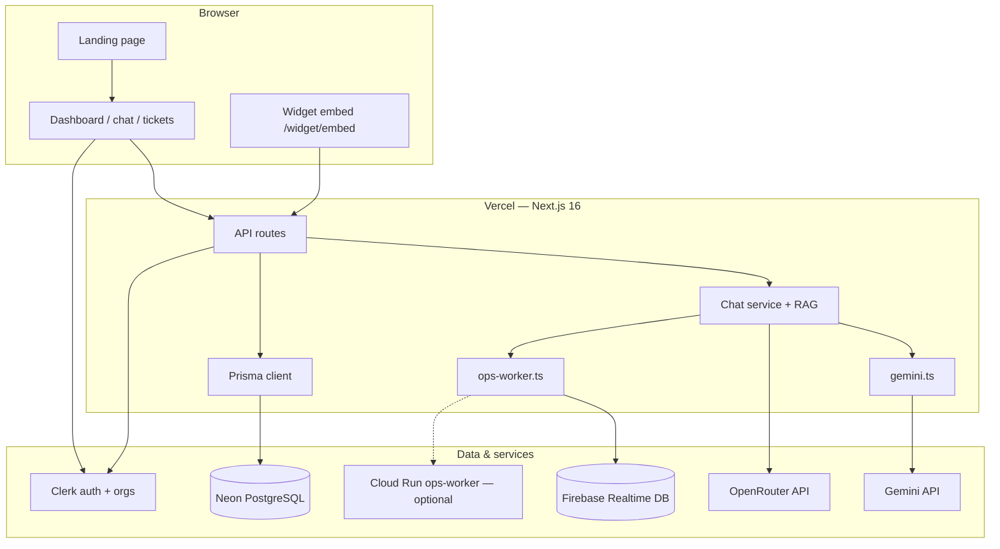

# System architecture

OpsConcierge runs as a Next.js app on Vercel, backed by Neon Postgres, with Clerk for auth and Gemini (plus OpenRouter fallback) for LLM calls. Widget intake runs write execution logs to Postgres and agent-run evidence to Firebase Realtime Database.

## High-level diagram



## Request paths

### Admin chat (`/chat`)

1. Browser → `POST /api/chat/stream`
2. `createChatStreamResponse` (`src/lib/chat/stream-handler.ts`) prepares RAG context
3. `streamChatReply` (`src/lib/chat/service.ts`) tries **Gemini first**, falls back to OpenRouter
4. Response streamed as SSE; assistant message saved to Postgres

Admin chat does **not** create `ExecutionRun` rows (channel = `ADMIN`).

### Widget chat (judge path)

1. Customer site loads iframe → `/widget/embed?key=...`
2. Widget → `POST /api/widget/chat/stream` with widget key + visitor token
3. Stream handler creates an **ExecutionRun** (`trigger: widget_intake`) and logs lane routing
4. RAG retrieval → Gemini (or OpenRouter fallback) → execution log entry (`agent: support-concierge`)
5. On Gemini success, `notifyOpsWorker` POSTs evidence to Firebase RTDB
6. User escalates → `POST /api/widget/tickets` → ticket created + log entry (`agent: ticket-updater`, `decision: ticket_created`)
7. Operator views `/widget/intake` — table of runs and log entries from Postgres

### Recruitment (`/recruitment`)

1. Resume upload → in-memory parse (`src/lib/recruitment/parse-resume.ts`)
2. Analyze → `POST /api/recruitment/analyze` → OpenRouter completion + deterministic match score
3. Results stored in `CandidateAnalysis`; audit events in `RecruitmentAuditEvent`

Recruitment does not use Gemini or Firebase evidence today.

## LLM routing (support chat)

Priority in `src/lib/chat/service.ts`:

| Condition | Provider | Evidence to Firebase |
|-----------|----------|----------------------|
| `GEMINI_API_KEY` set + RAG chunks found | Gemini | Yes (on `gemini_success`) |
| Gemini fails or unset | OpenRouter | No |
| No AI configured | Static fallback from doc snippet | No |

Model selection:

- Gemini: `GEMINI_CHAT_MODEL` (default `gemini-2.0-flash`) via `src/lib/gemini.ts`
- OpenRouter: `OPENROUTER_CHAT_MODEL` (default `openrouter/free`) via `src/lib/ai.ts`

`isAiConfigured()` returns true if either Gemini or OpenRouter is configured.

## RAG pipeline

1. Documents uploaded via `/api/documents/upload` → chunked and stored in `DocumentChunk`
2. Optional embeddings when `OPENROUTER_EMBEDDING_MODEL` is set
3. `retrieveRelevantChunksWithMode` — vector search when embeddings exist, else keyword
4. `buildRagPrompt` + org-specific system prompt from agent settings

## Multi-tenancy

- Each **Organization** has a unique `slug` and optional `clerkOrgId`
- Clerk webhook (`/api/webhooks/clerk`) syncs orgs and members
- Widget auth resolves org by `widgetPublicKey` (`src/lib/auth/widget.ts`)
- All queries scoped by `organizationId` / `workspaceId`

## Execution log (widget intake demo)

Postgres tables (see `prisma/schema.prisma`):

- **ExecutionRun** — one row per widget message turn (`trigger: widget_intake`)
- **ExecutionLogEntry** — steps within a run: lane-router, support-concierge, ticket-updater

UI: `src/app/(dashboard)/widget/intake/` + `src/components/execution/execution-log-table.tsx`

Typical log sequence:

```
lane-router       → route_to_gemini | route_to_openrouter | route_fallback_*
support-concierge → gemini_success | openrouter_success | ...
ticket-updater    → ticket_created (after escalation)
```

## GCP evidence path

Primary (free, no CLI): **Firebase Realtime Database**

- Config: `FIREBASE_DATABASE_URL`, optional `FIREBASE_RTDB_PATH` (default `opsconcierge_agent_runs`)
- Implementation: `src/lib/ops-worker.ts` — plain REST `POST` to `/{path}.json`
- Triggered from `logLlmCall` in chat service when `decision === "gemini_success"`

Optional fallback: **Cloud Run ops-worker**

- Config: `OPS_WORKER_URL`
- Code: `cloud-run/ops-worker/server.js` — `POST /v1/agent-runs`, logs to stdout (Cloud Logging) and optional GCS
- Not required for XPRIZE if Firebase RTDB is configured

Check readiness: `GET /api/health/xprize`

## Deployment topology

| Component | Host | Notes |
|-----------|------|-------|
| Next.js app | Vercel | Build: `npm run db:migrate:deploy && npm run build` |
| PostgreSQL | Neon | Pooled `DATABASE_URL` with `sslmode=require` |
| Auth | Clerk | Orgs enabled; webhook to `/api/webhooks/clerk` |
| LLM | Google AI Studio + OpenRouter | Env vars in Vercel project settings |
| Evidence | Firebase RTDB (Spark) | Open/test rules OK for demo |
| Rate limits | In-process or Upstash | Optional Redis env vars |

See [DEPLOY.md](../DEPLOY.md) for step-by-step production setup.

## Repo layout (relevant paths)

```
src/
  app/                    # Next.js App Router pages + API routes
  components/             # UI (execution log, widget, layout)
  lib/
    gemini.ts             # Gemini REST client
    ai.ts                 # OpenRouter client
    ops-worker.ts         # Firebase RTDB + Cloud Run notify
    chat/                 # Chat service + stream handler
    rag/                  # Retrieve, embed, confidence
    recruitment/          # Hiring lane services
prisma/
  schema.prisma           # Data model
  migrations/             # SQL migrations
cloud-run/
  ops-worker/             # Optional Cloud Run worker
```

## Security notes

- Never set `AUTH_BYPASS` in real production
- Widget keys are org-scoped secrets; rotate via Settings
- Firebase RTDB test rules allow open writes — fine for demo, lock down for production
- Gemini API key is server-side only (`GEMINI_API_KEY`, not `NEXT_PUBLIC_*`)
